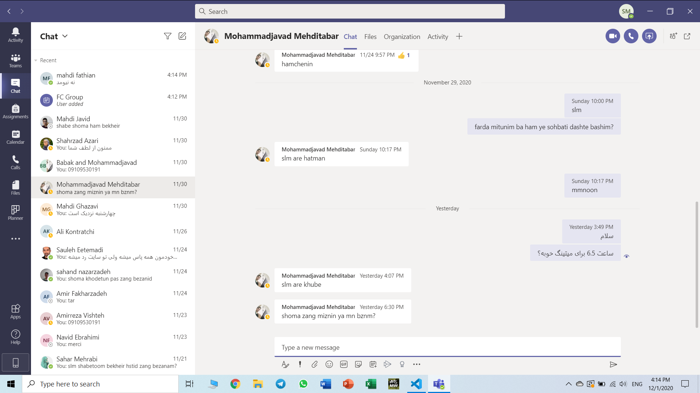

layout: posts
title: TA told me how tp study my lessons!
---

## These are my first term courses and way how to study them.

- English language : If you are good at it just read it last night. :))))
- FC : Try as hard as ypu can.
- Mathematics : Study it hard. 707 faramarzi is a good refrence.
- Islamic thinking: Last night :))))))

